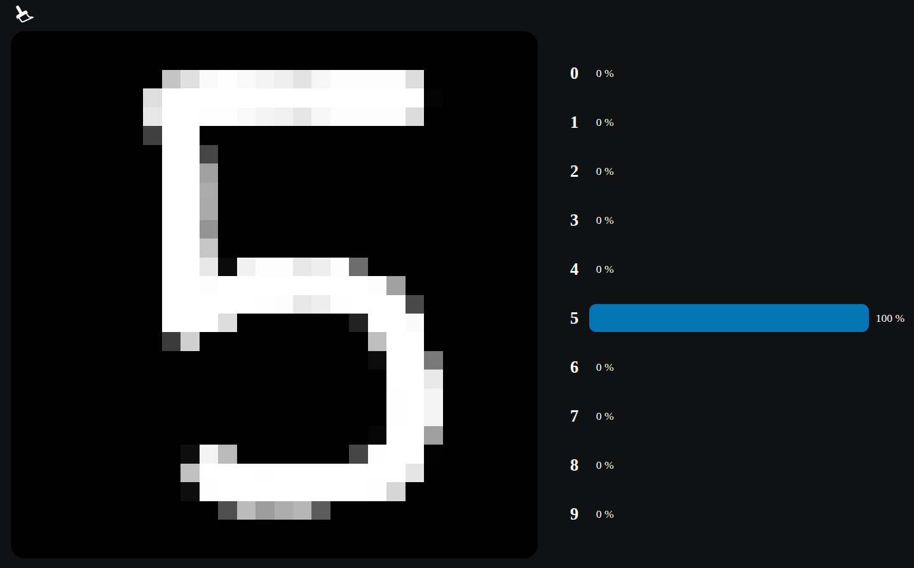

# DigitRecognition

* **Author:** Timothée Blanpied 
* **Created:** 2023/08

DigitRecognition is a small TensorFlow/Keras project that trains a convolutional neural network (CNN) on the MNIST dataset and provides a simple web-based drawing interface to make live digit predictions.

Overview
--------
This project contains a training notebook and a lightweight web UI that lets users draw digits in the browser and get realtime predictions from a pre-converted TensorFlow.js model.

What it does
-----------
- Trains a CNN on the MNIST handwritten digits dataset (training implemented in `DigitRecognition.ipynb`).
- Exposes a web drawing interface in the `interface/` folder where users can draw digits and see live predictions.

Tech stack
----------
- Python 3.8+
- TensorFlow / Keras
- TensorFlow.js (for the browser model)
- Numpy, Pandas, Matplotlib, ImageIO
- A tiny HTTP server to serve the interface (`interface/server.py`)

Example usage
-------------
1. Start the server with `python3 server.py`. (You must be inside `interface`)
2. Draw a digit in the canvas.
3. The frontend will load the TF.js model (if present) and display the predicted digit.

Quickstart (development)
------------------------
1. Create and activate a virtual environment (recommended):

	`python3 -m venv .venv`
	`source .venv/bin/activate`

2. Install dependencies:

	`pip install -r requirements.txt`

3. Dataset placement:

	- Place the MNIST image files and `labels.csv` under `dataset/mnist/` (this project expects `dataset/mnist/labels.csv`).

4. Train the model (optional):

	- Open `DigitRecognition.ipynb` in Jupyter and run the cells to preprocess data, train the CNN, and export a TensorFlow.js model.

5. Run the web interface locally (serves `interface/` at http://localhost:8000):

	`python3 server.py`

	Then open your browser at `http://localhost:8000`.

Where to put the browser model
------------------------------
- The interface expects a TensorFlow.js model (model.json + weights files). If you have a converted TF.js model, place it in `interface/model/` or update `interface/index.js` to point to the model location.

Screenshot
----------

License
-------
See the included `LICENSE` file.

Contact
-------
If you have questions, open an issue or contact the repository owner.
